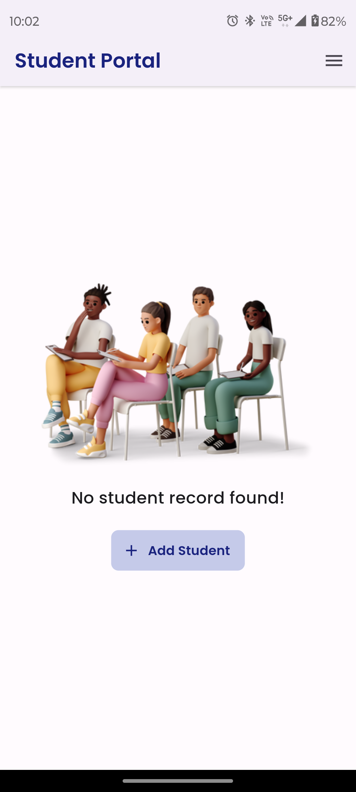
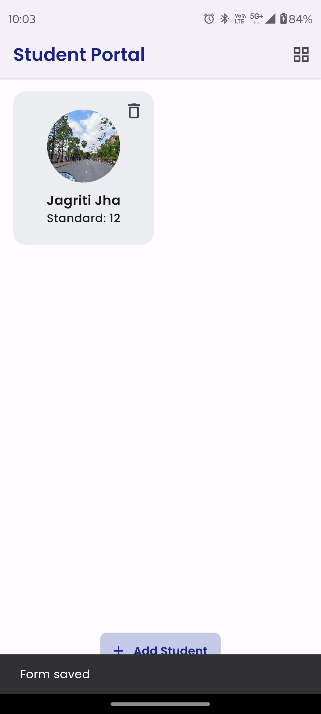
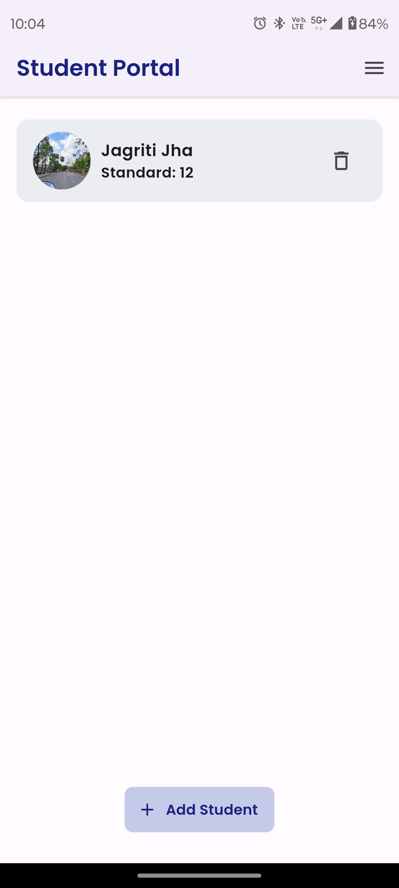
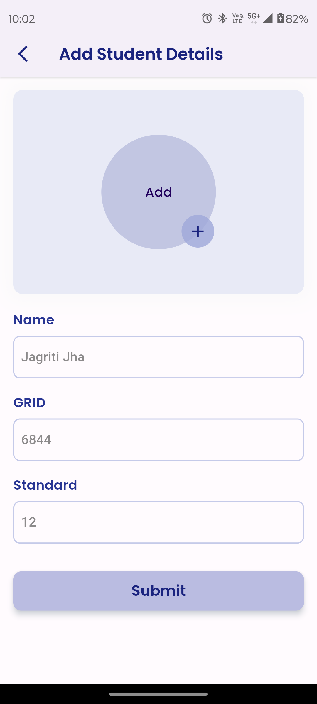
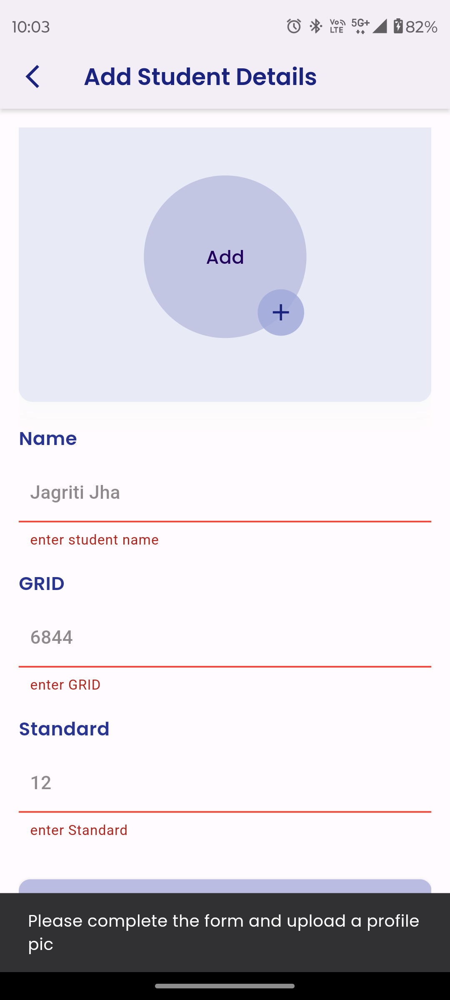
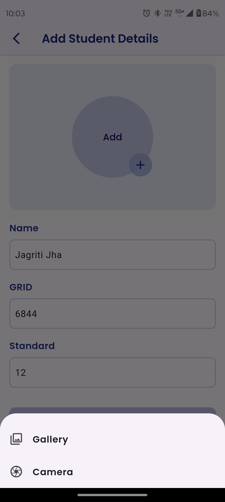
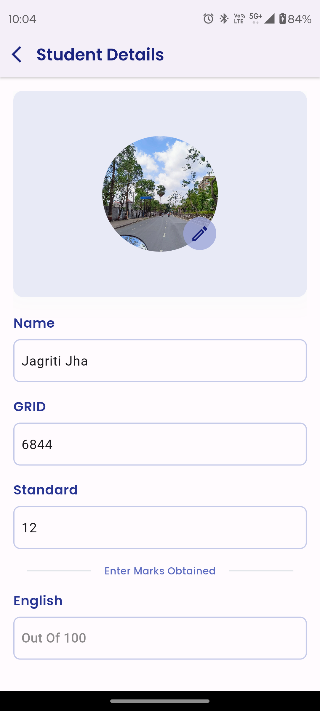
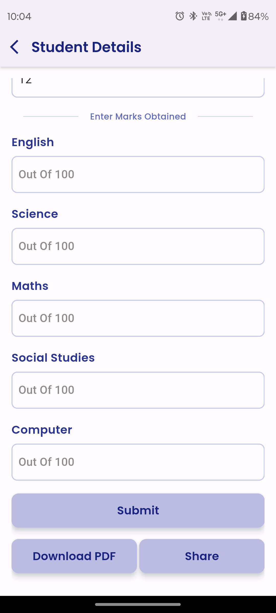
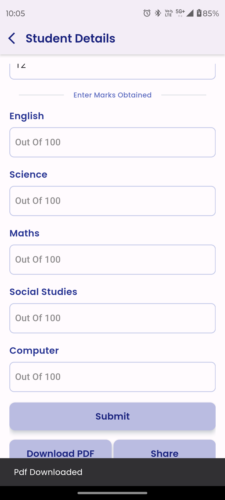
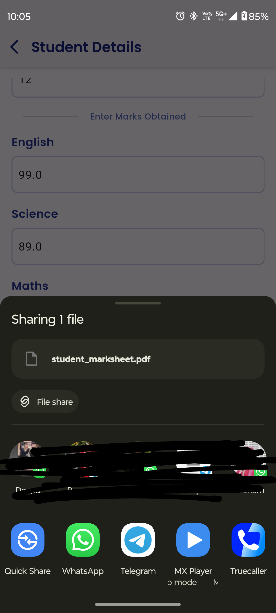

# Student Data Manager App

The Student Data Manager App is a dedicated mobile application designed to manage student information efficiently. This app allows users to enter, display, modify, and delete student records. It includes functionalities for handling data operations seamlessly, making it ideal for educational institutions or personal data management.

## Features

- **Data Entry**: Easily add new student records with details such as name, age, and course.

- **Dynamic Home Screen**: View all student records in a list, with options to edit or delete each entry directly.

- **Edit Functionality**: Modify existing student data through an intuitive interface.

- **Delete Functionality**: Remove student records with simple taps.

- **Empty State Screen**: A visually appealing screen that displays when no student records are available. It includes a button to add new records and graphics indicating the empty state.

- **Persistent Storage**: Student data is stored in objects and can be retrieved and modified as needed, ensuring data persistence across sessions.

## Screenshots

**Series of screenshots that demonstrate the app's functionality and UI:**  
<table style="border-collapse: collapse; width: 100%;">
<tr>
<th colspan="4" style="text-align: center; border: 0;">Screenshots</th>
</tr>
<tr>
<td style="width: 250px; border: 0;">

#### ✨ Home Screen (Empty)


</td>
<td style="width: 220px; border: 0;">

#### ✨ Home Screen (With Data)


</td><td style="width: 220px; border: 0;">

#### ✨ Home Screen (With Data)


</td>
<td style="width: 220px; border: 0;">

#### ✨ Edit Data Screen


</td>
<td style="width: 220px; border: 0;">

#### ✨ Data Entry Screen


</td>
<td style="width: 220px; border: 0;">

#### ✨ Edit Data Screen


</td>
<td style="width: 220px; border: 0;">

#### ✨ Edit Data Screen


</td><td style="width: 220px; border: 0;">

#### ✨ Edit Data Screen


</td><td style="width: 220px; border: 0;">

#### ✨ Edit Data Screen


</td><td style="width: 220px; border: 0;">

#### ✨ Edit Data Screen


</td>
<td style="width: 220px; border: 0;">

#### ✨ Edit Data Screen


</td>
</tr>
</table>

## Video Demo

Below is a video demonstrating the app's workflow and usage:


## How to Use

1. **Starting the App**:
    - Launch the app to view the splash screen, followed by the home screen displaying all student records.
    - If no records exist, the empty state screen is shown.

2. **Adding a Student**:
    - Tap the 'Add Student' button on the empty state screen or the '+' icon on the home screen.
    - Fill in the student's details and save.

3. **Modifying and Deleting Data**:
    - On the home screen, tap the 'Edit' icon next to any student record to modify.
    - Use the 'Delete' icon to remove a student record.

4. **Viewing Student Details**:
    - Tap on any student entry in the home screen list to view detailed information.

## Installation

To run the Student Data Manager App on your local machine, follow these steps:

```bash
git clone https://github.com/jagritixjha/student-data-manager-app.git
cd student-data-manager-app
flutter pub get
flutter run
